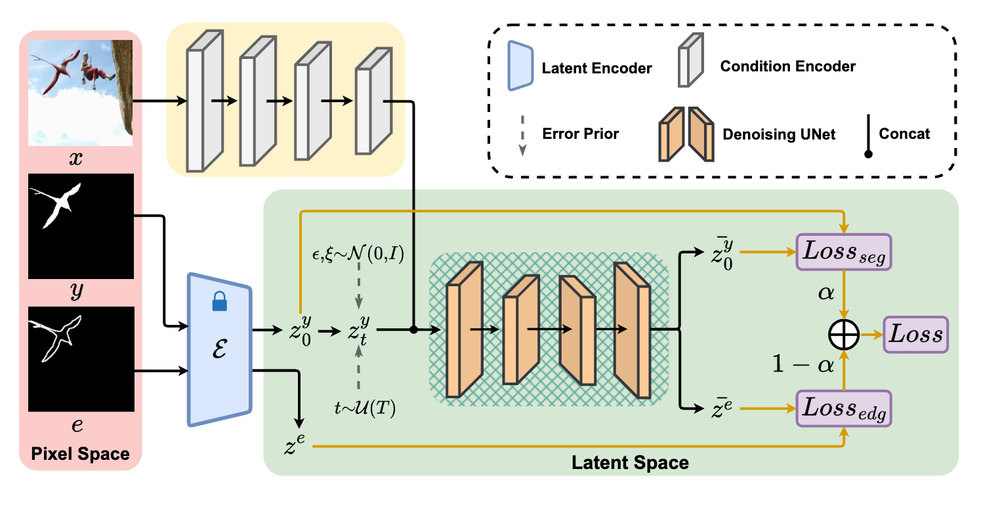

Towards Generalized Image Manipulation Localization via Score-based Model
========

Official repository for the ICMR 2026 paper "Towards Generalized Image Manipulation Localization via Score-based Model" [paper](http://arxiv.org/abs/2605.16879) [website](https://github.com/scu-zjz/DiffIML).

  
DiffIML introduces score-based generative modeling to Image Manipulation Localization (IML). Diverging from the direct estimation of hard decision boundaries, DiffIML approximates the score function to capture the intrinsic geometric topology of mask distributions. To ensure practicality and real-time inference, it leverages a Lightweight Mask-Specific VAE (LightVAE) distilled from Stable Diffusion, a decoupled denoising pipeline using a Segformer condition encoder, along with edge supervision and error prior mitigation mechanisms.

**Note:** 
All code in this project is developed based on the [IMDLBenCo](https://github.com/scu-zjz/IMDLBenCo) repository.

For any dataset-related issues or additional resources, please refer to the repository linked above. Below are the testing and training details for DiffIML based on this repository.

## 🔧 Test Instructions

<details>
<summary><b>Click to expand</b></summary>

### 1. Clone Project

```bash
git clone https://github.com/scu-zjz/DiffIML.git
cd DiffIML
```

### 2. Create and Activate Conda Virtual Environment

```bash
conda create -n diffiml python==3.10
conda activate diffiml
pip install torch torchvision
pip install imdlbenco
pip install diffusers transformers build twine
pip install "numpy<2"
pip install -r requirements.txt
```

### 3. Download Pretrained Checkpoints

This project uses Segformer (mit-b2 to mit-b5) models pretrained on ImageNet for the Condition Encoder.

Visit the official Segformer GitHub repository: [Segformer GitHub](https://github.com/NVlabs/SegFormer).

Navigate to the "Training" section in the repository's README and download the pretrained weights for mit-b2, mit-b3, mit-b4, and mit-b5.

#### Directory Structure

The directory structure of the checkpoints is as follows:

```plaintext
IMDLBenCo/
├── model_zoo/
│      └── diffiml/
│          ├── diffiml.py
│          ├── mit_b2.pth
│          ├── mit_b3.pth
│          ├── mit_b4.pth
│          ├── mit_b5.pth
│          └── resnet.py
├── runs/
│   ├── test_diffiml.sh
│   └── train_diffiml.sh
└── ...
```

### 4. Run Tests

During inference, DiffIML utilizes an ensemble generation strategy (default N=5) and 8 DDIM denoising steps for optimal balance between accuracy and efficiency.

```bash
sh runs/test_diffiml.sh
```

</details>

## 🚀 Training Instructions

<details>
<summary><b>Click to expand</b></summary>

DiffIML is trained in **two stages**: first the LightVAE mask compressor, then the conditional diffusion model.

### 1. Download Segformer Pretrained Weights

Download the Segformer **MiT-B3** ImageNet-1k pretrained weights from the official [SegFormer](https://github.com/NVlabs/SegFormer) repo and place the file at `IMDLBenCo/model_zoo/diffiml/mit_b3.pth` (or any path you prefer). For latent space modeling, you can either train the LightVAE from scratch or download our distilled weights.

```bash
sh runs/demo_train_light_vae.sh
```

### 2. Configure Parameters

Before running the training script, edit the parameters in `runs/train_diffiml.sh`:

1. `seg_pretrain_path`: Path pointing to the Segformer weights (e.g., `IMDLBenCo/model_zoo/diffiml/mit_b3.pth`).
2. `data_path`: Path to your `balanced_dataset.json`.
3. `student_weights`: Path to the distilled `light_vae_weights.pth`.

### 3. Run the Training Script

```bash
sh runs/train_diffiml.sh
```

(Optional) Inspect the reconstruction quality:

```bash
python evaluate_light_vae.py \
    --original_vae_path /path/ \
    --light_vae_weights ./log/train_light_vae/checkpoints/light_vae_weights.pth \
    --data_path ./runs/balanced_dataset.json \
    --output_dir ./vae_comparison_output
```

</details>

## 📌 Citation

If you find our work interesting or helpful, please give us a ⭐ and cite our paper. Your support truly encourages us!

```bibtex
@inproceedings{wang2026diffiml,
  title     = {Towards Generalized Image Manipulation Localization via Score-based Model},
  author    = {Wang, Yunfei and Du, Bo and Yang, Zhe and Liu, Xin and Lin, Zhiyu and Xu, Tianxin and Zhou, Ji-Zhe},
  booktitle = {Proceedings of the 2026 ACM International Conference on Multimedia Retrieval (ICMR)},
  year      = {2026}
}
```

Please also cite the underlying benchmark **IMDLBenCo**:

```bibtex
@inproceedings{ma2024imdlbenco,
  title     = {IMDL-BenCo: A Comprehensive Benchmark and Codebase for Image Manipulation Detection \& Localization},
  author    = {Ma, Xiaochen and Zhu, Xuekang and Su, Lei and Jiang, Zhuohang and Du, Bo and Wang, Xiwen and Lei, Zeyu and Feng, Wentao and Pun, Chi-Man and Zhou, Ji-Zhe},
  booktitle = {Advances in Neural Information Processing Systems (NeurIPS Datasets and Benchmarks)},
  year      = {2024}
}
```
